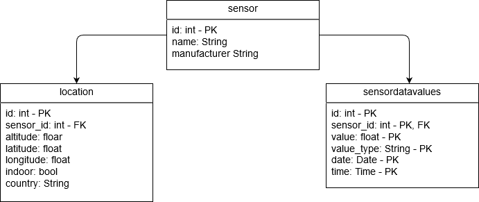

# Deployment-Guide für Docker-Compose

  - [Aufbau](#aufbau)
  - [Konfiguration](#konfiguration)
  - [Ausführung](#ausführung)
  - [PG-Admin4](#pg-admin4)
  - [Entwicklungs-Guide](#entwicklungs-guide)
    - [Docker-Compose Setup](#docker-compose-setup)
    - [TimescaleDB Setup](#timescaledb-setup)
    - [Grafana Setup](#grafana-setup)
    - [PgAdmin Setup](#pgadmin-setup)
    - [Python-Script Setup](#python-script-setup)
      - [Update-Script](#update-script)
      - [Delete-Script](#delete-script)

## Aufbau
Grundsätzlich sind derzeit alle Komponenten in Docker gehostet. 
Dadurch ist die gesamet Lösung plattformunabhängig und kann daher auf allen gängigen OS ausgeführt werden.


In der folgenden Darstellung kann man den aktuellen Containeraufbau des Projektes sehen:


## Konfiguration

Die Konfiguration *muss* über das `.env`-File vorgenommen werden.
Derzeit werden folgende Settings benötigt:

``` sh 
DB_HOST=<IP-Adresse von der DB>
DB_PORT=<Port von der DB> 
DB_NAME=<Name der Datenbank>
DB_USER=<User für Operationen>
DB_PASSWD=<Passwort für DB>
ADMIN_MAIL=<Email für PG-Admin>
ADMIN_PASSWORD=<Passwort für PG-Admin>
```

Sollte kein `.env`-File erstellt werden, kann die Anwendung nicht gestartet werden.

## Ausführung

Zur Ausführung des Projektes müssen nur zwei Kommandos ausgeführt werden:

1. Builden der Container
``` sh 
    docker-compose build
```

2. Eigentliche Ausführung des Projektes
``` sh
    docker-compose up -d
```

## PG-Admin4

Um die Datenbank leichter zu verwalten, wurde das Tool PG-Admin4 als Interface zur Datenbank hinzugefügt.

Um auf PG-Admin4 zuzugreifen muss einfach auf die Adresse `localhost:8080` zugegriffen werden.
Es sollte ein Login-Seite erscheinen die wie folgt ausschaut:

Die Logindaten können in der .env Datei konfiguriert werden.

## Entwicklungs-Guide
Hier wird kurz wie die einzelnen Komponenten aufgebaut sind und wie diese weiterentwickelt werden können.

### Docker-Compose Setup
Die Docker-Container-Struktur kann aus der obigen Grafik entnommen werden.
Alle Konfigurationen, welche für die Struktur benötigt werden, sind in dem `docker-compose.yml`-File zu finden.

### TimescaleDB Setup
Die Datenbank wird über den `init.sql`-Script umgesetzt. 
Jedes SQL-Statement in der Datei wir beim initialisieren des Datenbank-Containers ausgeführt. 
Wichtig ist nur zu erwähnen, dass die SQL-Statements nur umgesetzt werden, sofern kein Datenbank-Volumn vorhanden ist.

### Grafana Setup
Alle Konfigurationen welche mit Grafana zu tun haben, sind im `Grafana`-Ordner zu finden.  
Im `dashboards`-Ordner findet man die exportierten `json`-Datein von den erstellten Dashboards.
Sollten Änderungen an einem Dashboard durchgeführt werden, muss dieses anschließend neu exportieren werden und in diesen Ordner gespeichert werden.


Im `provisioning`-Ordner sind alle Konfigurationen enhalten, welche bei der Initialisierung ausgeführt werden.  
In der `dashboard.yml` Datei im `Grafana/provisioning/dashboards` Ordner sind die Konfigurationen hinterlegt, welche die verfügbaren Dashboards aus dem `dashboards` Ordner laden.  
Im `datasources`-Ordner sind die Konfigurationen für alle Datenquellen, welche nach dem Start verfügbar seien sollen.
Die Genauer aufbau kann in der offizellen [Grafana Dokumentation](https://grafana.com/docs/grafana/latest/administration/provisioning/)

### PgAdmin Setup
Die Konfiguration ist im `PgAdmin`-Ordner zu finden, genauer gesagt in dem `servers.json`-File.
Derzeit befinden sich darin nur Einstellungen, um die Verbindung zur Datenbank direkt herzustellen.
Da es derzeit nicht möglich ist, diese Werte durch `docker-compose` zu setzten, müssen die Konfigurationen mit denen in der `.env`-Datei übereinstimmen.

### Python-Script Setup
Die Python-Skripte `update_script.py` und `delete_script.py` sind in dem zugehörigen Ordner zu finden. Hier werden auch alle Packages in der `requirements.txt`-Datei definiert.

#### Update-Script
Das Datenbankmodell ist eine kürzere Variante als die, die `luftdaten.info` verwendet. Die Daten kommen von `http://api.luftdaten.info/static/v1/data.json`.


#### Delete-Script
Das Skript misst die Auslastung `df -h` (disk free) der Partition. Wird ein Schwellwert erreicht, so triggert er den Löschvorgang. Dadurch werden die ältesten Daten entfernt. Das vermeidet, das der Server aufgrund der Datenmenge abstürzt.
